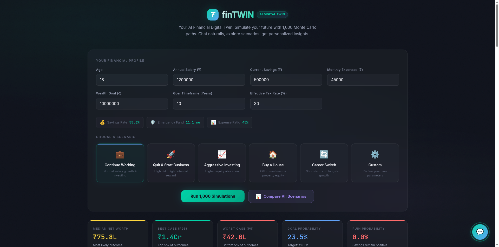

# finTWIN — AI Financial Digital Twin

finTWIN is a high-fidelity, client-side **Monte Carlo Financial Simulator** designed to model long-term wealth trajectories under various life and investing scenarios. It combines rigorous stochastic modeling with a natural-language **AI Planning Layer**, allowing users to explore their financial future through conversational "what-if" analysis.


*(Note: Placeholder for actual screenshot)*

## 🚀 Key Features

- **Monte Carlo Engine**: Executes 1,000+ simulations in real-time to generate probabilistic wealth outcomes (Median, Best Case P95, and Worst Case P5).
- **Conversational Planning**: Features an integrated AI assistant that understands complex life plans (e.g., *"What if I buy a house in 2 years and have a kid in 4 years?"*) and updates the simulation instantly.
- **AI Behavioral Analysis**: Detects patterns in your financial profile and provides personalized health scores, identifying risks like lifestyle inflation, insufficient runway, or low savings rates.
- **Dynamic Scenarios**: Explore pre-built or custom scenarios including:
    - **Career Transitions**: Models short-term cuts for long-term growth.
    - **Real Estate**: Evaluates EMI impacts vs. property equity buildup.
    - **Aggressive Investing**: Simulates high-volatility equity strategies with custom crash behaviors.
    - **Business Ventures**: Models bimodal outcomes for startup/quit-job scenarios.
- **Actionable AI Recommendations**: Generates structured narrative reports with specific action items (Immediate, Short-term, Long-term) and earning strategies to bridge wealth gaps.
- **Privacy-First**: Perfroms all heavy lifting client-side. No financial data is sent to a server (API keys are handled locally).

## 🛠️ Tech Stack

Built with a focus on high-performance visualization and modular logic without the overhead of heavy frameworks:

- **Core**: Vanilla HTML5, CSS3, and ES6+ JavaScript.
- **Visualization**: Custom-built **HTML5 Canvas API** renderer for high-frame-rate Fan Charts and performance-critical animations.
- **AI Intelligence**: 
    - **Gemini Pro 1.5 API**: Orchestrates complex planning and natural language interpretation.
    - **Deterministic Parser**: Fallback logic for rule-based planning when API is unavailable.
- **Typography**: Inter (Sans-serif) for UI clarity and JetBrains Mono for financial data readability.
- **Design System**: Modern **Glassmorphism** architecture using CSS design tokens, backdrop-filters, and motion-rich transitions.

## 📁 Project Structure

```bash
├── index.html          # Main application shell & UI components
├── style.css           # Premium glassmorphic design system & layout
├── js/
│   ├── app.js          # Master controller & state orchestration
│   ├── simulation.js   # Core Monte Carlo stochastic engine
│   ├── planner.js      # AI-native memory & composite life-planning
│   ├── behavioral.js   # Pattern detection & financial health engine
│   ├── narrative.js    # AI Analysis & Action Plan generator
│   ├── charts.js       # High-performance Canvas trajectory renderer
│   ├── chat.js         # Conversational UI & intent detection
│   ├── chat-api.js     # External AI integration layer (Gemini)
│   ├── config.js       # Framework-level constants & defaults
│   └── config.local.js # User-specific API configurations (Git-ignored)
```

## 💻 Local Development

1. **Clone the repo**:
   ```bash
   git clone https://github.com/sabeeh/finTWIN.git
   ```
2. **Launch**:
   Simply open `index.html` in any modern browser. No build steps or `npm install` required.
   
3. **Configure AI (Optional)**:
   To enable live Gemini AI planning:
   - Rename `js/config.js` patterns or create `js/config.local.js`.
   - Add your `GEMINI_API_KEY`.
   - The app will automatically switch from "Local Mode" to "Live AI Mode".

## ☁️ Deployment

finTWIN is production-ready for **Vercel** or **GitHub Pages**. 
- **Preset**: Other / Vanilla
- **Build Command**: None
- **Output Directory**: `.` (Root)

## ⚖️ Disclaimer

finTWIN is an educational simulation tool. It uses randomized probabilistic models to project potential outcomes. It does not constitute financial advice. Always consult with a certified financial professional before making major life decisions.
